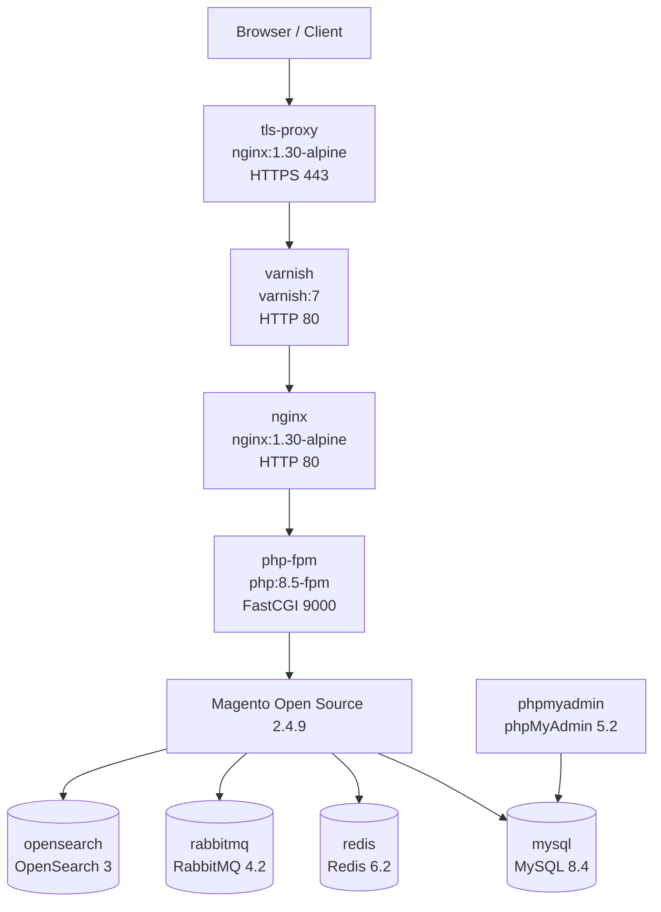
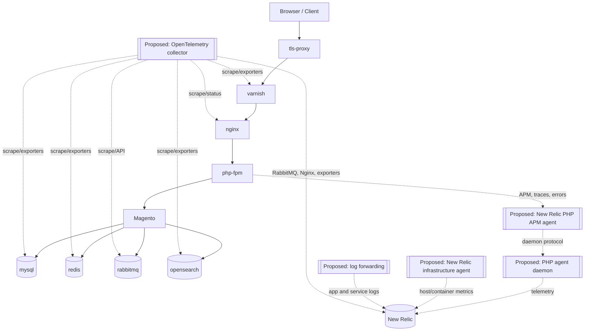

# Current Magento Docker Architecture

## Purpose

This document describes the current local Magento Open Source Docker stack before
New Relic observability is added. It intentionally avoids secrets from `.env`,
`auth/auth.json`, and `magento/app/etc/env.php`.

## Detected Runtime

| Area | Current value |
| --- | --- |
| Magento | Magento Open Source 2.4.9 |
| PHP | PHP 8.5 FPM image, PHP 8.5.6 observed at runtime |
| Web entrypoint | TLS proxy on `https://magento.docker` |
| Database | MySQL 8.4 |
| Cache/session | Redis 6.2 |
| Queue | RabbitMQ 4.2 management image |
| Search | OpenSearch 3 |
| Full page cache | Varnish 7 |
| Network | External Docker network `docker_magento_learning_network` |

## Request Flow

```text
Browser / Client
  -> tls-proxy:443
  -> varnish:80
  -> nginx:80
  -> php-fpm:9000
  -> Magento
       -> mysql:3306
       -> redis:6379
       -> rabbitmq:5672
       -> opensearch:9200
```

## Existing Architecture Diagram



## Proposed Observability Overlay

The New Relic components below are proposed only. They are not active in the
current stack.



## Docker Services

| Service | Image/build | Purpose | Host ports | Internal ports | Volumes | Depends on | Healthcheck |
| --- | --- | --- | --- | --- | --- | --- | --- |
| `tls-proxy` | `nginx:1.30-alpine` | Terminates local HTTPS and forwards to Varnish | `${HTTPS_PORT:-443}:443` | `443`, image also exposes `80` | `./tls/default.conf`, `./certs` | `varnish` healthy | `wget` HTTPS `/healthz` |
| `varnish` | `varnish:7` | Magento full page cache between TLS proxy and Nginx | none | `80`, `8443` from image | `./varnish/default.vcl` | `nginx` healthy | `varnishadm ping` |
| `nginx` | `nginx:1.30-alpine` | Serves Magento `pub/`, static/media routes, FastCGI to PHP-FPM | none | `80` | `./nginx/default.conf`, `./magento` read-only | `php-fpm` started | `wget` HTTP `/healthz` |
| `php-fpm` | `./php/Dockerfile` from `php:8.5-fpm` | Runs Magento PHP-FPM and CLI tooling | none | `9000` | `./magento`, `./auth` read-only for Composer auth | `mysql`, `opensearch`, `rabbitmq`, `redis` healthy | `php-fpm -t` |
| `mysql` | `mysql:8.4` | Magento database | none | `3306`, `33060` | `mysql_data` | none | `mysqladmin ping` |
| `phpmyadmin` | `phpmyadmin:5.2-apache` | Local database UI | `${PHPMYADMIN_PORT:-8081}:80` | `80` | none | `mysql` healthy | none |
| `opensearch` | `opensearchproject/opensearch:3` | Magento catalog search | `${OPENSEARCH_PORT:-9200}:9200` | `9200`, `9300`, `9600`, `9650` | `opensearch_data` | none | HTTP `/_cluster/health` |
| `rabbitmq` | `rabbitmq:4.2-management` | Magento AMQP message queue and management UI | `${RABBITMQ_MANAGEMENT_PORT:-15672}:15672` | `5672`, `15672`, other RabbitMQ ports | `rabbitmq_data` | none | `rabbitmq-diagnostics -q ping` |
| `redis` | `redis:6.2-alpine` | Magento default cache and sessions | none | `6379` | `redis_data` | none | `redis-cli ping` |

The live Compose-generated container names currently follow the default pattern:

| Service | Observed container name |
| --- | --- |
| `tls-proxy` | `docker_magento-tls-proxy-1` |
| `varnish` | `docker_magento-varnish-1` |
| `nginx` | `docker_magento-nginx-1` |
| `php-fpm` | `docker_magento-php-fpm-1` |
| `mysql` | `docker_magento-mysql-1` |
| `phpmyadmin` | `docker_magento-phpmyadmin-1` |
| `opensearch` | `docker_magento-opensearch-1` |
| `rabbitmq` | `docker_magento-rabbitmq-1` |
| `redis` | `docker_magento-redis-1` |

## Network Communication

All services join the external Docker network named
`docker_magento_learning_network`. Service discovery uses Compose service names.

| Source | Destination | Purpose |
| --- | --- | --- |
| Browser | `tls-proxy:443` via host port | Local HTTPS entrypoint |
| `tls-proxy` | `varnish:80` | Reverse proxy to cache layer |
| `varnish` | `nginx:80` | Backend fetches |
| `nginx` | `php-fpm:9000` | FastCGI execution |
| `php-fpm` / Magento | `mysql:3306` | Database |
| `php-fpm` / Magento | `redis:6379` | Cache/session storage |
| `php-fpm` / Magento | `rabbitmq:5672` | AMQP publish/consume |
| `php-fpm` / Magento | `opensearch:9200` | Search/indexing |
| `phpmyadmin` | `mysql:3306` | Local database admin UI |

## Important Configuration Files

| File | Purpose |
| --- | --- |
| `docker-compose.yml` | Service topology, images, volumes, healthchecks, network |
| `.env.example` | Non-secret local environment template |
| `.env` | Local runtime values, may contain credentials and must not be exposed |
| `php/Dockerfile` | PHP 8.5 FPM image, Composer, required Magento PHP extensions |
| `php/conf.d/magento.ini` | Magento PHP memory, timeout, upload, opcache settings |
| `nginx/default.conf` | Magento public root, FastCGI routing, health endpoints, access/error logs |
| `tls/default.conf` | HTTPS termination, certificate paths, proxy headers |
| `varnish/default.vcl` | Magento Varnish behavior, purge ACL, cache/pass rules |
| `magento/app/etc/env.php` | Installed Magento environment configuration and service connections |
| `magento/app/etc/config.php` | Magento module/config state |
| `scripts/magento-deploy.sh` | Local deployment workflow and Redis/Varnish cache configuration |
| `magento/app/code/Training/StockNotifyQueue/etc/*.xml` | Custom queue topology, publisher, consumer, DI, and schema config |

## Magento Service Connections

| Magento area | Current service |
| --- | --- |
| Database default connection | `mysql`, database `magento` |
| AMQP queue | `rabbitmq:5672`, virtual host `/` |
| Default cache | Redis service `redis:6379`, DB `0` |
| Sessions | Redis service `redis:6379`, DB `2` |
| Full page cache | Varnish through HTTP cache host `varnish:80` |
| Search | OpenSearch service `opensearch:9200`, index prefix from environment |
| Custom training queue | Topic `training.erp.stock.increase`, queue `training.erp.stock.increase.queue`, consumer `training.erp.stock.increase.consumer` |

## Logging Locations

| Component | Current log source |
| --- | --- |
| TLS proxy | `/var/log/nginx/tls-proxy-access.log`, `/var/log/nginx/tls-proxy-error.log`, plus Docker logs |
| Nginx | `/var/log/nginx/magento-access.log`, `/var/log/nginx/magento-error.log`, plus Docker logs |
| Varnish | Container stdout/stderr; runtime cache counters available through Varnish tools |
| PHP-FPM | Container stdout/stderr and PHP-FPM process logs |
| Magento | `magento/var/log/system.log`, `exception.log`, `debug.log` when enabled |
| MySQL | Container logs and MySQL internal logs inside the data volume |
| RabbitMQ | Container logs and RabbitMQ internal log paths inside the container/data volume |
| Redis | Container stdout/stderr |
| OpenSearch | Container logs and logs under `/usr/share/opensearch/logs` inside the container |

## Existing Health Status

The stack uses container healthchecks for `tls-proxy`, `varnish`, `nginx`,
`php-fpm`, `mysql`, `opensearch`, `rabbitmq`, and `redis`. `phpmyadmin` has no
healthcheck because it is a convenience UI.

The healthchecks confirm process or basic endpoint availability. They do not
capture application latency, dependency latency, queue depth, cache hit ratio,
slow queries, search performance, or log/error trends.

## Existing Operational Risks

- Observability is limited to healthchecks and manual `docker compose logs`.
- There is no central place to correlate Magento errors with Nginx, Varnish,
  queue, database, cache, or search behavior.
- Service ports for OpenSearch, RabbitMQ management, phpMyAdmin, and HTTPS are
  exposed to the host for local learning convenience.
- MySQL slow query logging is not configured.
- Varnish, PHP-FPM, and Nginx status endpoints for metrics are not enabled.
- Queue backlog and consumer health are not monitored.
- Magento cron health is not monitored.
- Debug logs can grow quickly if enabled.
- Local credentials exist in `.env` and `env.php`; observability configuration
  must not forward secrets or request bodies.
- OpenSearch runs with security disabled for local learning.
- The external Docker network must exist before startup.

## Existing Observability Gaps

- No New Relic PHP APM agent.
- No New Relic infrastructure agent.
- No distributed tracing.
- No browser monitoring.
- No centralized log forwarding.
- No logs-in-context metadata.
- No container CPU/memory/restart dashboards.
- No RabbitMQ queue-depth or missing-consumer alerts.
- No Redis memory, evictions, or hit-ratio dashboards.
- No MySQL slow-query or connection saturation dashboards.
- No OpenSearch JVM, shard, disk, or query-latency dashboards.
- No Varnish cache hit-ratio dashboard.
- No Magento cron or queue consumer operational dashboard.
- No documented alert policy, verification guide, or troubleshooting runbooks.
