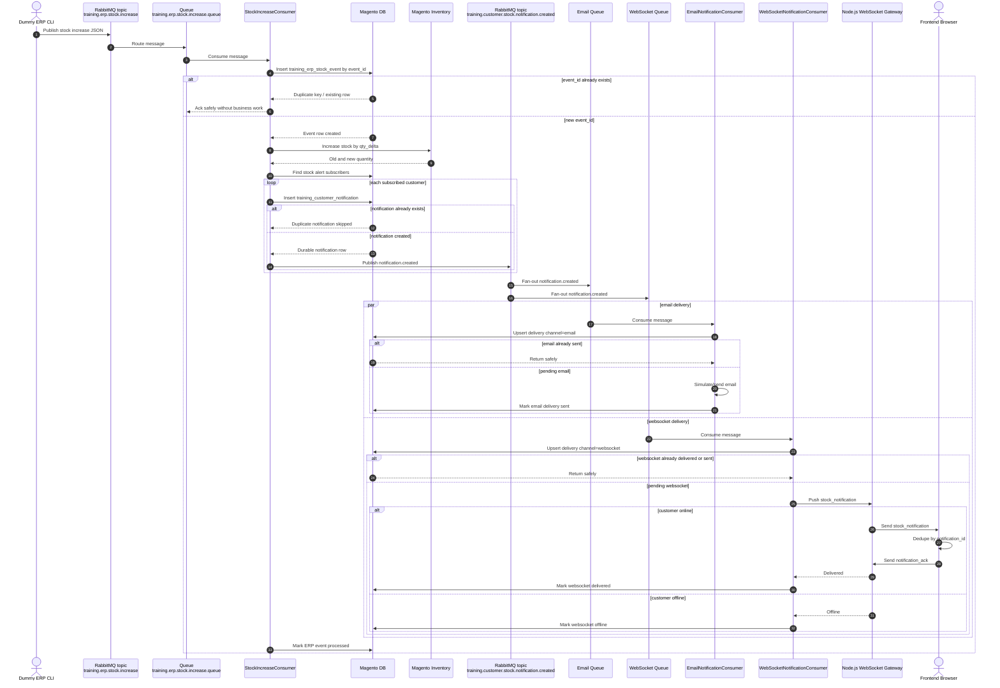
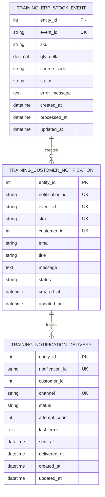

# Architecture

## Goal

Define the message flow, fan-out topology, idempotency boundaries, and WebSocket gateway boundary.

## End-To-End Flow

```text
Dummy ERP CLI command
  -> publish training.erp.stock.increase
  -> training.erp.stock.increase.queue
  -> StockIncreaseConsumer
  -> training_erp_stock_event idempotency check
  -> stock update
  -> find stock alert subscribers
  -> create training_customer_notification rows
  -> publish training.customer.stock.notification.created
  -> fan-out to email and websocket queues
  -> EmailNotificationConsumer
  -> WebSocketNotificationConsumer
  -> frontend browser notification
```

## Sequence Diagram



## ERP Stock Topic

Topic:

```text
training.erp.stock.increase
```

Queue:

```text
training.erp.stock.increase.queue
```

Consumer:

```text
training.erp.stock.increase.consumer
```

Handler:

```text
Training\StockNotifyQueue\Model\Queue\StockIncreaseConsumer::process
```

## Notification Created Topic

Topic:

```text
training.customer.stock.notification.created
```

Fan-out queues:

```text
training.customer.stock.notification.email.queue
training.customer.stock.notification.websocket.queue
```

Consumers:

```text
training.customer.stock.notification.email.consumer
training.customer.stock.notification.websocket.consumer
```

## Notification Created Payload

```json
{
  "notification_id": "1001",
  "event_id": "ERP-STOCK-1001",
  "sku": "ABC-001",
  "customer_id": 25,
  "email": "customer@example.com",
  "title": "Product back in stock",
  "message": "ABC-001 is available now."
}
```

## WebSocket Boundary

Magento PHP should not hold long-running browser WebSocket connections.

Use a separate Node.js WebSocket gateway. Magento pushes to the gateway from `WebSocketNotificationConsumer`; the gateway owns browser connections and customer socket mapping.

## ER Diagram



Logical relationships:

- One `training_erp_stock_event` can create many `training_customer_notification` rows.
- One `training_customer_notification` can create one delivery row per channel.
- `training_customer_notification` is unique by `(event_id, sku, customer_id)`.
- `training_notification_delivery` is unique by `(notification_id, channel)`.

## Offline Rule

WebSocket delivery is not durable.

If the customer is offline:

- Mark websocket delivery as `offline`.
- Do not fail the stock event.
- Do not fail email delivery.
- Keep `training_customer_notification` as the durable source of truth.
- Let the frontend fetch unread notifications later in a future extension.
